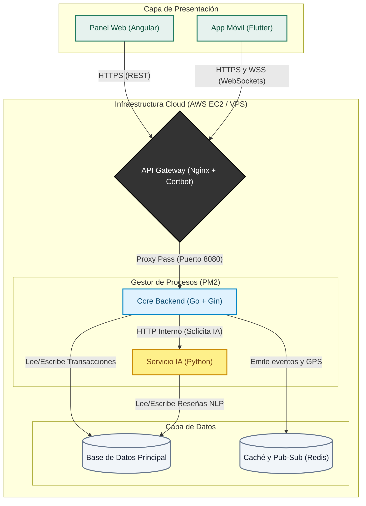

```mermaid
graph TD;
    %% Definición de estilos
    classDef client fill:#e6f2ee,stroke:#1E7A5E,stroke-width:2px,color:#145541;
    classDef proxy fill:#333,stroke:#000,stroke-width:2px,color:#fff;
    classDef service fill:#e0f2fe,stroke:#0284c7,stroke-width:2px,color:#0c4a6e;
    classDef ai fill:#fef08a,stroke:#ca8a04,stroke-width:2px,color:#713f12;
    classDef db fill:#f1f5f9,stroke:#64748b,stroke-width:2px,color:#0f172a;

    subgraph Clientes ["Capa de Presentación"]
        A["Panel Web (Angular)"]
        B["App Móvil (Flutter)"]
    end

    subgraph Cloud ["Infraestructura Cloud (AWS EC2 / VPS)"]
        C{"API Gateway (Nginx + Certbot)"}

        subgraph Procesos ["Gestor de Procesos (PM2)"]
            D["Core Backend (Go + Gin)"]
            E["Servicio IA (Python)"]
        end

        subgraph Datos ["Capa de Datos"]
            F[("Base de Datos Principal")]
            G[("Caché y Pub-Sub (Redis)")]
        end
    end

    %% Conexiones
    A -- "HTTPS (REST)" --> C
    B -- "HTTPS y WSS (WebSockets)" --> C
    C -- "Proxy Pass (Puerto 8080)" --> D
    D -- "HTTP Interno (Solicita IA)" --> E
    D -- "Lee/Escribe Transacciones" --> F
    E -- "Lee/Escribe Reseñas NLP" --> F
    D -- "Emite eventos y GPS" --> G

    %% Asignación de estilos (Sintaxis segura)
    class A,B client;
    class C proxy;
    class D service;
    class E ai;
    class F,G db;
```